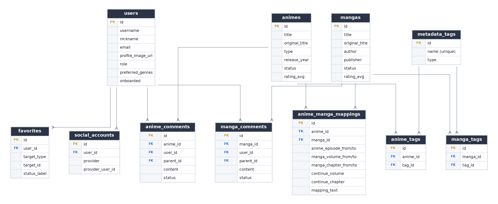

# 애만보 (애니 보고 만화 보고)

> 애니메이션을 다 본 뒤, **원작 만화를 몇 권 몇 화부터 이어 보면 되는지** 즉시 알려주는 애니↔만화 매핑 플랫폼

직접 스트리밍은 제공하지 않고, 공식 PV 임베드 + 정교한 매핑 데이터 + AI 추천에 집중해 저작권 리스크를 줄인 서브컬처 유틸리티 서비스입니다.

---

## ✨ 주요 기능

- **애니 ↔ 원작 이어보기 매핑** — `애니 1기 → 원작 7권 54화부터` 형태의 브릿지 UI, 시즌별 이어보기 모달
- **통합 검색 + 자연어 검색 폴백** — 제목 검색이 0건이면 ① 줄거리·장르 DB 검색 → ② LLM이 DB 작품 목록에서 직접 선택(환각 방지). "도깨비" 같은 키워드로도 작품 탐색
- **AI 추천 챗봇** — 자연어/무드 기반 추천, DB에 실재하는 작품만 클릭형 카드로 제공 (OpenAI)
- **개인화** — 첫 로그인 시 선호 장르 설문 → 홈 "오늘의 랜덤 픽"을 취향 맞춤으로
- **커뮤니티** — 작품별 댓글 CRUD(소프트 삭제), 프로필 사진
- **소셜 로그인** — 카카오 / 네이버 / 구글
- **마이페이지** — 찜한 콘텐츠, 나의 활동, 프로필·선호 장르 편집
- **관리자 인라인 편집** — 관리자 계정으로 작품 상세에서 제목·원제·줄거리 즉시 수정

---

## 🛠 기술 스택

| 분류 | 기술 |
| --- | --- |
| Frontend | Vue 3, Vite, vue-router |
| Backend | Python, Django 5.2 + DRF (세션 인증) |
| Database | SQLite (개발) |
| AI | OpenAI (gpt-4o-mini) |
| 데이터 수집 | AniList GraphQL, MangaUpdates API |

---

## 📁 프로젝트 구조

```
aemanbo/
├── backend/                 # Django + DRF
│   ├── apps/
│   │   ├── works/           # 작품·매핑·태그, 검색, 추천, 관리자 수정, 데이터 적재
│   │   ├── users/           # 회원·소셜계정·프로필·선호장르·온보딩
│   │   ├── interactions/    # 찜·댓글
│   │   └── chat/            # AI 챗봇 + 자연어 검색 폴백
│   ├── data/works.csv       # 작품·매핑 데이터셋
│   ├── scripts/             # 데이터 수집·전처리·검증 스크립트
│   └── config/              # settings·urls
├── frontend/                # Vue 3 SPA (Vite)
└── docs/                    # 기획·구현 명세 (PROJECT_SPEC, IMPLEMENTATION_SPEC, DATASET)
```

---

## 🗂 DB ERD



- **works** — `animes`, `mangas`, `anime_manga_mappings`(이어보기 지점), `metadata_tags`(+`anime_tags`/`manga_tags`로 N:M)
- **users** — `users`(선호 장르·역할 포함), `social_accounts`
- **interactions** — `favorites`, `anime_comments`/`manga_comments`(대댓글·소프트 삭제)

---

## 🚀 시작하기

### 1) 백엔드

```sh
cd backend
python -m venv .venv && source .venv/bin/activate    # Windows: .venv\Scripts\activate
pip install -r requirements.txt

python manage.py migrate
python manage.py import_dataset --fresh --works data/works.csv   # 작품·매핑 적재
python manage.py seed_comments  # (선택) 시연용 더미 댓글/유저
python manage.py createsuperuser # (선택) 관리자 → /admin

python manage.py runserver      # http://127.0.0.1:8000
```

### 2) 프론트엔드 (새 터미널)

```sh
cd frontend
npm install
npm run dev                     # http://localhost:5173
```

브라우저에서 http://localhost:5173 접속. `/api` 요청은 Vite 프록시로 Django(8000)에 전달됩니다.

---

## 🔑 환경 변수 (`backend/.env`)

미설정 시 해당 기능만 비활성화되고 나머지는 정상 동작합니다.

```ini
# 소셜 로그인 (OAuth 앱 redirect URI: http://localhost:5173/auth/callback/{provider})
KAKAO_CLIENT_ID=
KAKAO_CLIENT_SECRET=
NAVER_CLIENT_ID=
NAVER_CLIENT_SECRET=
GOOGLE_CLIENT_ID=
GOOGLE_CLIENT_SECRET=

# AI 추천 챗봇 / 자연어 검색
OPENAI_API_KEY=
OPENAI_MODEL=gpt-4o-mini
OPENAI_BASE_URL=https://api.openai.com/v1
```

---

## 🗃 데이터 파이프라인

작품·매핑 데이터는 **직접 만든 CSV + Python 스크립트**로 수집 → 전처리 → 검증 → 적재합니다.

```
[수집]  collect_anilist.py      AniList — 애니↔만화 관계·메타데이터
[수집]  enrich_mangaupdates.py  MangaUpdates — 애니화 범위·이어보기 힌트
[전처리] translate_dataset.py    줄거리/제목 한글화·정제
[검증]  classify_continue.py    이어보기 지점(start/end) 출처 기반 자동 분류
[적재]  manage.py import_dataset --fresh   →  SQLite DB
```

> 약 1,000개 애니↔만화 매핑, 이어보기 지점 892개 확보.

---

## ⚙️ 주요 관리 명령

```sh
python manage.py import_dataset --fresh --works data/works.csv   # 데이터 (재)적재(중복 제거)
python manage.py seed_comments                                   # 시연용 더미 댓글/유저
python manage.py seed_works                                      # 소규모 샘플 시드
```

---

## 🔌 API 요약

| 영역 | 엔드포인트 |
| --- | --- |
| 홈/검색 | `GET /api/v1/home/` · `GET /api/v1/search/` · `POST /api/v1/search/ai/` · `GET /api/v1/genres/` |
| 인증 | `GET /api/v1/auth/oauth/{provider}/url/` · `.../callback/` · `POST /api/v1/auth/logout/` |
| 애니 | `GET·PATCH /api/v1/animes/{id}/` · `.../manga-mappings/` · `.../comments/` |
| 만화 | `GET·PATCH /api/v1/mangas/{id}/` · `.../anime-mappings/` · `.../comments/` |
| 찜/마이 | `POST·DELETE /api/v1/favorites/` · `GET /api/v1/users/me/{profile,favorites,comments}/` |
| 챗봇 | `POST /api/v1/chat/message/` · `DELETE /api/v1/chat/session/` |

---

## 👥 팀

| 이름 | 역할 |
| --- | --- |
| 김경민 (팀장) | 풀스택 개발 |
| 김선종 | 풀스택 개발 |

> SSAFY 15기 관통 PJT
